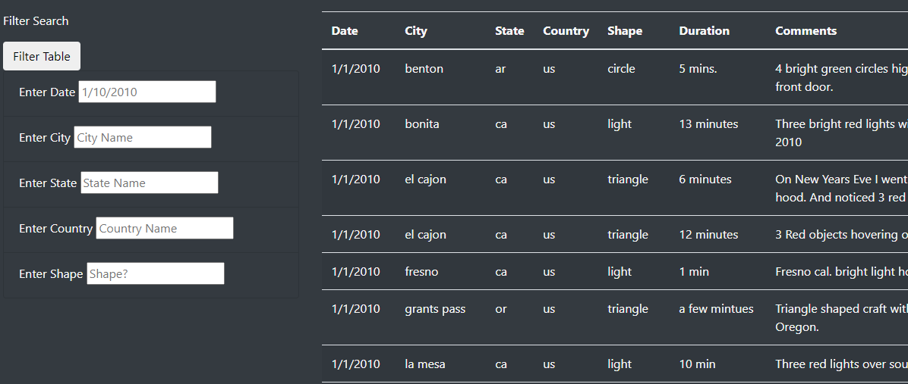

## Overview
The purpose of this analysis is to create an interactive web page that can easily filter UFO sighting data based on geographic locations, dates of sightings, and shapes of UFOs. 

## Results
Filtering can be performed by going to the filters on the page, finding the “Filter Search” table on the left side of the screen, and typing in the date/city/state/country/shape a user wants to filter in the appropriate field. 

###  

## Summary- Drawbacks and Recommendations
One drawback of this webpage is that there is not a user friendly option to export the filtered data to a  personal file or database for further analysis. 

Additional recommendations for the web page would be a map that displays geographic locations of sightings and a filter “button” attached to the column headers that would display all unique row values a user could select from.  
